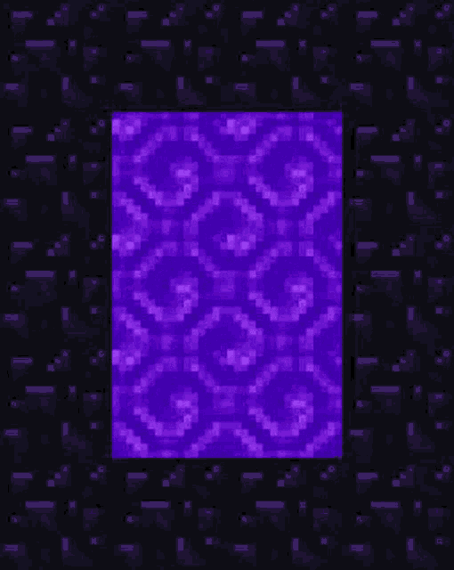

<p align="center">
  
</p>

<p align="center">
  
</p>

<p align="center">
  
</p>

<p align="center">
  
</p>

<p align="center">✧˖°. ⋆｡˚ ⊹ ˚｡⋆ .°˖✧</p>

## ✧˖°. `> /whoami`

```java
public class Developer {
    String role           = "Full Stack Developer";
    String location       = "Medellín, Colombia 🇨🇴";
    String currentMission = "Building mods and plugins for Minecraft";
    String[] hobbies      = { "Music", "Science fiction", "Video games" };
}
```

## ⋆｡˚ Achievements unlocked

- **End Traveler** ⊹ currently building mods and plugins for Minecraft (๑•̀ㅂ•́)و✧
- **Full Stack Architect** ⊹ from Spring Boot backends to Angular frontends
- **Star Reader** ⊹ sci-fi fan because reality is boring (｡•̀ᴗ-)✧
- **Focus Mode** ⊹ always coding with music on ♪(´▽｀)
- **Coordinates** ⊹ Medellín, Colombia 🇨🇴

## ✧ Inventory

<p align="center">
  
</p>

<p align="center">
  
  
</p>

## ˚｡⋆ Stats

<p align="center">
  
  
</p>

<p align="center">
  
</p>

## ⊹ Contact

<p align="center">
  <a href="https://x.com/_mahyro"></a>
  <a href="mailto:mahyroemail@gmail.com"></a>
</p>

<p align="center">(￣▽￣)ノ ✧˖°. thanks for stopping by .°˖✧</p>

<p align="center">
  
</p>
